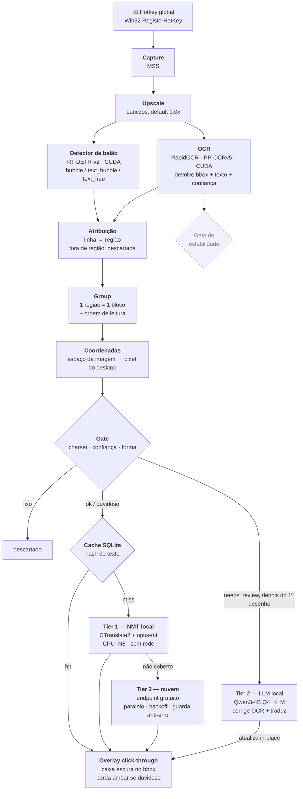
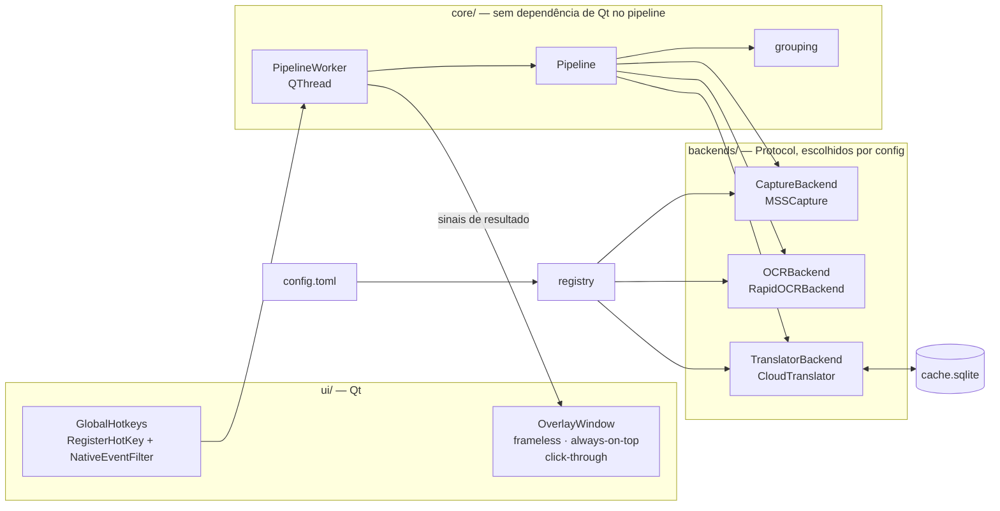

# TranslatorOCR

Tradutor de tela ao vivo para Windows: captura uma região da tela, encontra onde há texto, reconhece, traduz, e desenha o resultado **em cima do texto original** — caixas escuras estilo legenda, na posição de cada balão ou linha de diálogo.

O caso de uso primário é **ler mangá sem tradução no navegador**, rolando a página normalmente. O secundário são jogos com diálogo em inglês.

> **Status: funcionando.** Captura por hotkey (MSS ou DXcam, com seleção de área opcional), detector de balão, OCR na GPU, gate entre reconhecimento e tradução, e tradução em três tiers — NMT local primeiro, nuvem como reserva, e um LLM local que corrige OCR duvidoso num segundo passe — desenhando em overlay click-through. O que ainda não existe é o tracking de scroll contínuo (ver "Modos de operação" abaixo).

## Como rodar

```bash
uv sync
uv run scripts/fetch_models.py   # detector de balão + NMT + LLM local (~3 GB)
uv run python -m translatorocr
```

Os modelos do RapidOCR vêm sozinhos no primeiro uso; estes não têm esse mecanismo, então o download é explícito. O script é idempotente e pula o que já está lá. Sem eles o app ainda roda: o detector desliga, o tier de LLM desliga, e a tradução cai para a nuvem — tudo com aviso no log, nunca crash.

O tier de LLM (correção de OCR + tradução, segundo passe sobre o que o gate marcou duvidoso) depende de `llama-cpp-python`, que **não tem wheel pré-compilado com CUDA para Windows** — precisa compilar do zero:

```bash
uv sync --group llm
```

Se isso falhar tentando achar `cl.exe`/CUDA, rode de dentro de um **"x64 Native Tools Command Prompt for VS"** (ou `vcvars64.bat`), com o gerador Ninja instalado (`uv tool install ninja`):

```bash
set CMAKE_GENERATOR=Ninja
set CMAKE_ARGS=-DGGML_CUDA=on
set FORCE_CMAKE=1
uv sync --group llm --reinstall-package llama-cpp-python
```

Sem isso o app roda normalmente, só sem o tier de correção por LLM (fica só cache + NMT + nuvem).

`F8` traduz o que está na tela · `F9` limpa o overlay · `F10` sai · `F11` clica-e-arrasta pra escolher a área de captura (default é tela cheia; um clique sem arrastar reseta) · `F7` mostra/esconde uma borda tracejada na área que o F8 vai capturar, útil pra conferir a seleção antes de disparar o pipeline de verdade. Tudo é ajustável em [config.toml](config.toml), que é opcional — os defaults estão embutidos no código.

Para conferir se as caixas estão caindo no lugar certo (útil ao mudar a escala do display):

```bash
uv run python -m translatorocr --debug-dump
```

Isso salva um PNG da captura com os bboxes desenhados por cima, o que torna erro de coordenada visível em vez de "parece torto".

## Verificação

Um comando roda tudo — formatação, lint, tipos e testes — e devolve exit code agregado:

```bash
uv run scripts/check.py             # verifica, não altera nada
uv run scripts/check.py --fix       # formata e aplica os fixes seguros do ruff antes
uv run scripts/check.py --no-tests  # só lint e tipos, para iterar rápido
uv run scripts/check.py -k grouping # argumentos extras vão para o pytest
```

```
  ✔ RUFF FORMAT      0.1s
  ✔ RUFF LINT        0.1s
  ✔ PYRIGHT          3.8s
  ✔ PYTEST           3.4s

Tudo passou.
```

O ruff roda com `BLE` e `N` habilitados de propósito: os `except Exception` do projeto são decisões conscientes de fronteira (ctypes, rede, carga de modelo) e cada um carrega um `noqa` explicando, e os overrides do Qt precisam violar a convenção de nome (`paintEvent`, `a0`, `eventType`) para manter compatibilidade de assinatura com os stubs do PyQt6.

---

## Arquitetura

### Pipeline de uma captura

Linha cheia é o que está implementado; linha tracejada é o que ainda falta plugar.



Dois pontos não óbvios do desenho.

O **detector não recorta a imagem para o OCR** — ele classifica as linhas que o OCR já achou. Rodar o reconhecedor uma vez por região recortada custa caro: numa tela cheia com 78 regiões o estágio salta de 1.95 s para **21.70 s**, porque o RapidOCR redetecta texto dentro de cada recorte e o custo por chamada domina. Rodar só o reconhecedor sobre a região também não serve — ele espera um recorte justo de *uma linha*, e com a região inteira devolve lixo. Então o reconhecedor roda uma vez na imagem inteira e as regiões servem para agrupar e filtrar.

O **gate** tem duas saídas, não uma. Lixo evidente é descartado antes de pagar tradução; o que é apenas duvidoso segue, marcado, e o overlay desenha a caixa com borda âmbar. Ler uma tradução incerta sabendo que ela é incerta é melhor que lê-la com a mesma aparência confiante de um acerto — e é esse mesmo sinal (`needs_review`) que o tier de LLM consome para decidir se vale acordá-lo.

**O tier de LLM não é "mais um tier" da cadeia de tradução.** NMT/nuvem quase sempre têm sucesso mesmo em blocos `needs_review` — o problema ali não é falta de tradução, é OCR duvidoso entrando cru. Por isso o LLM roda como uma **segunda passada**, depois que a tradução rápida já foi desenhada: o overlay mostra o resultado do NMT quase instantâneo, e a caixa é atualizada in-place quando o LLM termina (a mesma borda âmbar segue visível até lá). Um bloco de uma palavra só (onomatopeia, número de página) nem chega a ir para o LLM: sem contexto real pra traduzir, ele "alucina" e repete a tradução do bloco anterior.

O gate de estabilidade, esse sim ainda não existe: jogos animam texto letra por letra, e OCR disparado no meio da animação lê meia frase. Exigir N leituras idênticas consecutivas só faz sentido no modo contínuo, onde há um frame anterior com que comparar.

O upscale antes do OCR está no pipeline, mas desligado por padrão. Com PP-OCRv5, glifo de 11px já sai perfeito no tamanho nativo, e fazer o upscale valer exigiria subir `max_side_len` junto — o que custa 17x mais tempo pelo mesmo resultado. O estágio continua como knob, com default `1.0`.

### Módulos



Três protocolos, não quatro: o RapidOCR faz detecção e reconhecimento na mesma chamada, então um `DetectorBackend` separado seria abstração especulativa. Se um detector e um reconhecedor separados entrarem no futuro, um `CompositeOCR(detector, recognizer)` implementa o mesmo `OCRBackend` e o pipeline não muda.

Isso não é abstração por esporte: uma versão anterior, mais simples, tinha captura, OCR, tradução e UI dentro de um único método de uma classe de widget, e trocar qualquer peça exigia reescrever a classe.

Os modelos são carregados **uma vez** no ciclo de vida do processo, e o pipeline roda em worker thread — o Qt só recebe sinal de resultado, nunca executa inferência.

---

## Stack

| Estágio                  | Escolha                                                  | Por quê                                                                                                                                                                                                                                                                                           |
| ------------------------ | --------------------------------------------------------- | ------------------------------------------------------------------------------------------------------------------------------------------------------------------------------------------------------------------------------------------------------------------------------------------------ |
| Captura                  | **MSS** e **DXcam**                                      | MSS cobre o caso navegador, instala limpo e captura o desktop virtual inteiro. DXcam usa Desktop Duplication e é o único que funciona em jogo D3D em fullscreen exclusivo, onde o BitBlt do MSS devolve tela preta                                                                                |
| Upscale                  | **Lanczos, 1.0x**                                        | Desligado por padrão *depois de medir* — ver a nota na Arquitetura                                                                                                                                                                                                                                |
| OCR                      | **RapidOCR** · PP-OCRv5 · `onnxruntime-gpu`              | Mesmos modelos do PaddleOCR sem o inferno de instalar `paddlepaddle-gpu` no Windows/Python 3.13. Rec `en` mantém o charset em ASCII, o que torna ideograma irrepresentável na saída                                                                                                              |
| Cache                    | **SQLite** por hash do texto de origem                   | Fala repetida é instantânea e sempre traduz igual                                                                                                                                                                                                                                                 |
| Tradução                 | Endpoint web gratuito, em paralelo                       | O mesmo que Translumo e Textractor usam na prática. Com guarda contra a página de erro que o endpoint devolve sob rate limit                                                                                                                                                                     |
| Detecção de balão        | **RT-DETR-v2** (`ogkalu/comic-text-and-bubble-detector`) | Devolve `bubble`/`text_bubble`/`text_free`, então a fronteira do bloco vem do modelo em vez de heurística de proximidade. NMS-free, com o pós-processamento embutido no grafo ONNX. Apache-2.0                                                                                                   |
| Gate reconhecer→traduzir | Charset + confiança + heurística de forma                | Lixo é descartado antes de pagar tradução; o duvidoso segue marcado e ganha borda âmbar no overlay                                                                                                                                                                                                |
| Tradução rápida          | **CTranslate2 + opus-mt-tc-big-en-pt**                   | Tier primário: 50 balões em 0.82 s em **CPU**, contra 11.4 s da nuvem. Ilimitado e offline. Roda em CPU de propósito — ver a nota abaixo                                                                                                                                                         |
| Tradução com correção    | **Qwen3-4B Q4_K_M** (`llama-cpp-python`, GGUF)           | Corrige artefato de OCR e traduz num passo só, com contexto rolante e glossário. Escolhido depois de medir contra o Qwen3-8B: qualidade equivalente em frases reais, mas ~3x mais rápido e com bem mais folga de VRAM. Consome o `needs_review` que o gate já emite                             |

**O NMT roda em CPU por decisão, não por limitação.** O `ctranslate2.dll` carrega `cublas64_12.dll` por nome, e este venv tem CUDA 13 (veio do `onnxruntime-gpu`). Ligar a GPU custaria o wheel `nvidia-cublas-cu12` de ~553 MB mais um `os.add_dll_directory` manual, para então disputar VRAM com o OCR e o detector. Em CPU são 0.82 s para 50 balões — 14x mais rápido que a nuvem — e a tradução ainda roda concorrente com a inferência de GPU.

**O LLM local, ao contrário, roda na GPU — e precisa ser compilado assim.** `llama-cpp-python` não tem wheel pré-compilado com suporte a CUDA para Windows/cp313; instalar sem cuidado dá um build CPU-only silencioso (`llama_supports_gpu_offload()` volta `False` sem erro nenhum). Compilar com GPU exige o gerador Ninja e rodar dentro de um ambiente com `cl.exe` no PATH (ver "Como rodar" acima) — o gerador MSBuild padrão do CMake não tem a integração de toolset CUDA no Windows.

**Sem pré-processamento de imagem.** Grayscale, sharpen e aumento de contraste são hábito da era Tesseract e **pioram** reconhecedor neural — o sharpen cria ringing nas bordas anti-aliased, que é exatamente o que faz confundir `rn`↔`m` e `l`↔`I` em fonte de computador limpa.

---

## Modos de operação

**Freeze por hotkey** (v1) — aperta a tecla, o frame congela, o pipeline roda uma vez e as caixas ficam desenhadas até a próxima hotkey. Simples e robusto.

**Tracking contínuo** (v2, planejado) — captura contínua a ~15 fps sobre a região; a cada frame, mede o deslocamento vertical do scroll por correlação de fase (`cv2.phaseCorrelate`, ~1 ms) e translada as caixas já desenhadas pelo delta em vez de re-OCRar, disparando o pipeline só para a faixa de conteúdo novo entrando na viewport — caixas que saem da viewport são descartadas. É o que torna a leitura em rolagem infinita realmente fluida, e o pedaço mais arriscado do projeto: correlação de fase degrada quando o conteúdo muda além de uma translação pura (imagem carregando aos poucos, scroll horizontal, zoom), o que vai exigir um detector de "delta não confiável" que force um re-OCR completo. Só faz sentido plugar depois de o modo freeze estar estável em uso real — não é pré-requisito de nada no resto do projeto.

---

## Limitações conhecidas

- **Fullscreen exclusivo não mostra overlay.** Nenhuma tecnologia que não seja injeção no swapchain compõe por cima de um jogo em fullscreen exclusivo. Rode o jogo em **borderless windowed**.
- **Não há modo clipboard.** Foi removido por decisão de escopo, não por omissão: era um polling de `pyperclip` que duplicava o Textractor sem o hooking de memória que é o diferencial dele. Para texto copiável, use o Textractor.
- **Windows apenas.** `RegisterHotKey`, os flags `WS_EX_*` do overlay e o DPI awareness são específicos da plataforma.
- **Sem gate de estabilidade ainda.** O overlay desenha o primeiro resultado de OCR que chegar. Para mangá parado isso é suficiente; para jogo que anima texto letra por letra, não. Só faz sentido no modo de tracking contínuo, onde existe frame anterior para comparar — por isso depende dele entrar primeiro.
- **O detector é treinado em mangá/HQ, e fora dessa distribuição rende menos.** Numa tela de IDE ele dispara `text_free` em quase toda a interface: o ganho medido foi de 102 para 45 blocos — real, mas vindo de agrupar melhor, não de descartar UI (só 1 linha caiu fora de todas as regiões). Numa página de mangá, que é o caso de uso primário, os dois efeitos devem valer. Para texto de tela genérico, `detector.enabled = false` volta ao comportamento anterior ao detector.
