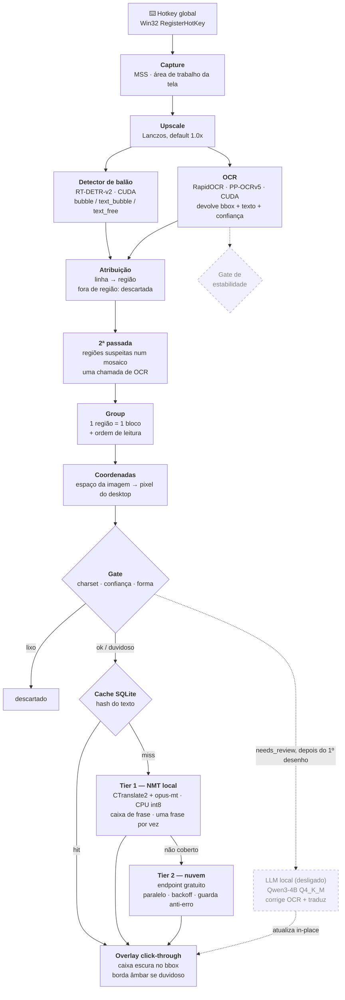
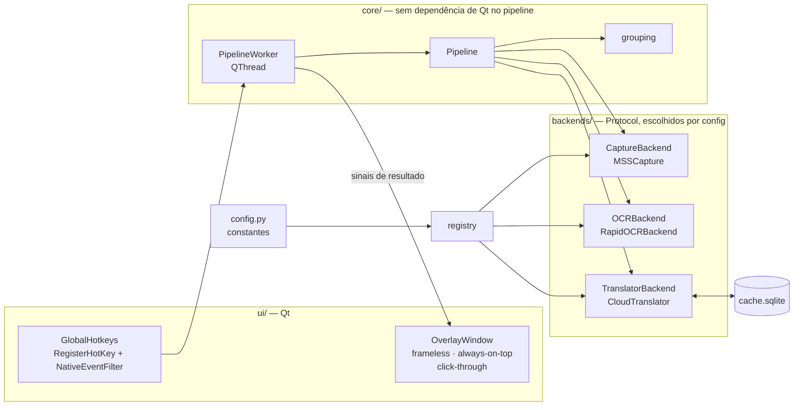

# TranslatorOCR

Tradutor de tela ao vivo para Windows: captura uma região da tela, encontra onde há texto, reconhece, traduz, e desenha o resultado **em cima do texto original** — caixas escuras estilo legenda, na posição de cada balão ou linha de diálogo.

O caso de uso é **ler mangá sem tradução no navegador**, rolando a página normalmente. Jogos com diálogo em inglês funcionam, mas não são o foco.

> **Status: funcionando.** Captura por hotkey e modo leitura que acompanha a rolagem (com seleção de área opcional), detector de balão, OCR na GPU com segunda passada para o que o primeiro passe perdeu, gate entre reconhecimento e tradução, e tradução **local** (NMT offline, com a nuvem como reserva), desenhando em overlay click-through. O que está em aberto mora em [OCR_ANALYSIS.md](OCR_ANALYSIS.md) e [ROADMAP.md](ROADMAP.md).

## Como rodar

```bash
uv sync
uv run python -m translatorocr
```

Não há nada para configurar. Na primeira execução o app baixa sozinho o detector de balão e o tradutor offline (~640 MB), com o progresso no console; os modelos do RapidOCR também vêm sozinhos. Sem rede, o app ainda abre: sem o detector ele agrupa por proximidade, e sem o NMT a tradução vai para a nuvem — com aviso, nunca crash. `uv run scripts/fetch_models.py` baixa os mesmos modelos à mão (ou força um re-download com `--force`).

Ao abrir, o console mostra só isto:

```
TranslatorOCR — tradutor de mangá, inglês → português
  Pronto em 5.3s · tradução offline

  F8   traduzir a tela (ou a área selecionada)
  F6   modo leitura — as traduções acompanham a rolagem e o que entra é traduzido sozinho quando você para
  F11  selecionar área — clique e arraste; um clique sem arrastar volta à tela cheia
  F7   mostrar/esconder a borda da área que o F8 captura
  F9   limpar a tradução da tela
  F10  sair

  Também pelo ícone perto do relógio.

  7 balões · 0.7s
```

O ícone na bandeja tem os mesmos comandos, mais **Monitor** (em qual tela capturar) e **Detalhes no console** (os logs internos, que ficam escondidos por padrão; `-v` liga desde o início). A captura padrão é a tela inteira sem a barra de tarefas. Quando aparece texto que não é do mangá (título de janela, interface do site), `F11` restringe a captura à área da página.

Balão com borda âmbar é leitura duvidosa: confiança baixa, glifo estranho removido, ou balão cortado pela borda da captura.

### LLM local (opcional, desligado)

Existe um tier de LLM (Qwen3-4B) que corrige OCR duvidoso e traduz de novo, num segundo passe. Ele fica **desligado por padrão**: medido em páginas reais, ele nunca aciona em página limpa e, quando forçado, traduziu pior que o NMT (trocou sentido, errou concordância, repetiu a fala anterior), ocupando ~2.5 GB de VRAM. Para ligá-lo, `LLMConfig.enabled` em [config.py](translatorocr/config.py), `uv run scripts/fetch_models.py llm`, e o `llama-cpp-python` compilado com CUDA, que **não tem wheel pré-compilado para Windows**:

```bash
uv sync --group llm
```

Se isso falhar tentando achar `cl.exe`/CUDA, rode de dentro de um **"x64 Native Tools Command Prompt for VS"** (ou `vcvars64.bat`), com o gerador Ninja instalado (`uv tool install ninja`):

```bash
set CMAKE_GENERATOR=Ninja
set CMAKE_ARGS=-DGGML_CUDA=on
set FORCE_CMAKE=1
uv sync --group llm --reinstall-package llama-cpp-python
```

### Por que não há arquivo de configuração

Havia um `config.toml` com mais de 60 knobs, e quase nenhum era algo que se ajusta para usar o app. Alguns eram ilusórios: trocar o caminho do modelo de NMT, por exemplo, não funcionaria sem mudar código, porque o backend está amarrado ao par en→pt e ao token de idioma daquele modelo. Os valores continuam num lugar só, [config.py](translatorocr/config.py), com o comentário de onde cada número medido veio; o que é escolha de uso (área, monitor) se escolhe em runtime.

### Diagnóstico

Duas ferramentas com papéis diferentes.

**Rodar contra uma imagem, sem a tela participar:**

```bash
uv run python -m translatorocr --image eval/pages/page01.webp
```

Abre a página numa janela e roda o pipeline direto sobre o arquivo — sem screenshot. A roda do mouse rola a página, então o `F6` também fica testável assim. Como a tela não entra na conta, dá para usar a máquina normalmente enquanto isso, e nenhuma janela que passe na frente estraga o resultado.

**Ver o que a captura enxergou:**

```bash
uv run python -m translatorocr --debug-dump
```

Salva um PNG da captura de tela com os bboxes desenhados por cima. É o que torna erro de coordenada visível em vez de "parece torto", e a forma de confirmar que o overlay não está entrando na própria foto.

## Verificação

Um comando roda tudo — formatação, lint, tipos e testes — e devolve exit code agregado:

```bash
uv run scripts/check.py             # verifica, não altera nada
uv run scripts/check.py --fix       # formata e aplica os fixes seguros do ruff antes
uv run scripts/check.py --no-tests  # só lint e tipos, para iterar rápido
uv run scripts/check.py -k grouping # argumentos extras vão para o pytest
```

```
  ✔ RUFF FORMAT      0.1s
  ✔ RUFF LINT        0.1s
  ✔ PYRIGHT          3.8s
  ✔ PYTEST           3.4s

Tudo passou.
```

Isso cobre a lógica, não a qualidade em página real. Para isso há o `eval_pages.py`, que roda sobre screenshots de mangá guardados localmente em `eval/pages/` (fora do versionamento — são páginas de terceiros), cada um com o texto esperado de cada balão num `.json` ao lado:

```bash
uv run scripts/eval_pages.py          # todas as páginas
uv run scripts/eval_pages.py page02   # uma só
```

Cada página roda inteira e em 8 vistas de tela simuladas (reduzida a 100/80/65/50% dentro de um desktop 1920x1080, no topo e no meio do scroll), e o script aponta balão faltando, lixo e balão duplicado. Para acrescentar uma página, basta o screenshot e o JSON. Ele substitui o `dataset/` como referência: aquele são recortes de 160x200 com rótulo ruidoso, e passar nele não previu o resultado numa página de verdade.

O ruff roda com `BLE` e `N` habilitados de propósito: os `except Exception` do projeto são decisões conscientes de fronteira (ctypes, rede, carga de modelo) e cada um carrega um `noqa` explicando, e os overrides do Qt precisam violar a convenção de nome (`paintEvent`, `a0`, `eventType`) para manter compatibilidade de assinatura com os stubs do PyQt6.

---

## Arquitetura

### Pipeline de uma captura

Linha cheia é o que está implementado e ligado; linha tracejada é o que falta plugar ou está desligado.



Os pontos não óbvios do desenho.

O **detector não recorta a imagem para o OCR** — ele classifica as linhas que o OCR já achou. Rodar o reconhecedor uma vez por região recortada custa caro: numa tela cheia com 78 regiões o estágio salta de 1.95 s para **21.70 s**, porque o RapidOCR redetecta texto dentro de cada recorte e o custo por chamada domina. Rodar só o reconhecedor sobre a região também não serve — ele espera um recorte justo de *uma linha*, e com a região inteira devolve lixo. Então o reconhecedor roda uma vez na imagem inteira e as regiões servem para agrupar e filtrar.

A **segunda passada** existe porque o detector de linha do RapidOCR (DBNet) perde o que o detector de balão acha: em página real, um balão de uma palavra só não ganhava caixa em nenhuma escala, e uma linha curta saía com letra duplicada. Região sem linha, com linha de confiança baixa, ou com linhas cobrindo pouco da sua altura (linha perdida) é recortada com margem **branca**, empilhada num mosaico com as outras suspeitas e reconhecida numa **única** chamada, o que mantém a regra acima; a leitura original concorre e fica a melhor. Nas páginas de teste, em 18 vistas, isso levou de 69 para 82 balões lidos exatamente e de 10 para 1 errado, por ~150 ms. Margem tirada da própria imagem e múltiplas escalas no mosaico foram tentadas e pioraram (detalhes em [ocr_composite.py](translatorocr/backends/ocr_composite.py)).

O **gate** tem duas saídas, não uma. Lixo evidente é descartado antes de pagar tradução; o que é apenas duvidoso segue, marcado, e o overlay desenha a caixa com borda âmbar. Ler uma tradução incerta sabendo que ela é incerta é melhor que lê-la com a mesma aparência confiante de um acerto. Um glifo impossível no meio de uma frase boa (um alfa grego no lugar de um D) é removido e marca o bloco, em vez de derrubar o balão inteiro; bloco sem nenhuma letra (decoração lida como "80") é descartado.

**O tier de LLM não é "mais um tier" da cadeia de tradução**, e hoje está desligado. NMT/nuvem quase sempre têm sucesso mesmo em blocos `needs_review` — o problema ali não é falta de tradução, é OCR duvidoso entrando cru. Por isso o LLM foi desenhado como uma **segunda passada**, depois que a tradução rápida já foi desenhada, atualizando a caixa in-place. Medido em página real, ele não compensou (ver "LLM local" em "Como rodar").

O gate de estabilidade, esse sim ainda não existe: jogos animam texto letra por letra, e OCR disparado no meio da animação lê meia frase. Deixou de estar bloqueado — o modo leitura já mantém o quadro anterior — mas continua sem prioridade, porque o caso é de jogo e o foco é mangá (S3 no [ROADMAP.md](ROADMAP.md)).

O upscale antes do OCR está no pipeline, mas desligado por padrão. Com PP-OCRv5, glifo de 11px já sai perfeito no tamanho nativo, e fazer o upscale valer exigiria subir `max_side_len` junto — o que custa 17x mais tempo pelo mesmo resultado. O estágio continua como knob, com default `1.0`.

### Módulos



Três protocolos, não quatro: o RapidOCR faz detecção e reconhecimento na mesma chamada, então um `DetectorBackend` separado seria abstração especulativa. Se um detector e um reconhecedor separados entrarem no futuro, um `CompositeOCR(detector, recognizer)` implementa o mesmo `OCRBackend` e o pipeline não muda.

Isso não é abstração por esporte: uma versão anterior, mais simples, tinha captura, OCR, tradução e UI dentro de um único método de uma classe de widget, e trocar qualquer peça exigia reescrever a classe.

Os modelos são carregados **uma vez** no ciclo de vida do processo, e o pipeline roda em worker thread — o Qt só recebe sinal de resultado, nunca executa inferência.

---

## Stack

| Estágio                  | Escolha                                                  | Por quê                                                                                                                                                                                                                                                                                           |
| ------------------------ | --------------------------------------------------------- | ------------------------------------------------------------------------------------------------------------------------------------------------------------------------------------------------------------------------------------------------------------------------------------------------ |
| Captura                  | **MSS** e **DXcam**                                      | MSS cobre o caso navegador, instala limpo e captura o desktop virtual inteiro. DXcam usa Desktop Duplication e é o único que funciona em jogo D3D em fullscreen exclusivo, onde o BitBlt do MSS devolve tela preta                                                                                |
| Upscale                  | **Lanczos, 1.0x**                                        | Desligado por padrão *depois de medir* — ver a nota na Arquitetura                                                                                                                                                                                                                                |
| OCR                      | **RapidOCR** · PP-OCRv5 · `onnxruntime-gpu`              | Mesmos modelos do PaddleOCR sem o inferno de instalar `paddlepaddle-gpu` no Windows/Python 3.13. Rec `en` mantém o charset em ASCII, o que torna ideograma irrepresentável na saída                                                                                                              |
| Cache                    | **SQLite** por hash do texto de origem                   | Fala repetida é instantânea e sempre traduz igual                                                                                                                                                                                                                                                 |
| Tradução                 | Endpoint web gratuito, em paralelo                       | O mesmo que Translumo e Textractor usam na prática. Com guarda contra a página de erro que o endpoint devolve sob rate limit                                                                                                                                                                     |
| Detecção de balão        | **RT-DETR-v2** (`ogkalu/comic-text-and-bubble-detector`) | Devolve `bubble`/`text_bubble`/`text_free`, então a fronteira do bloco vem do modelo em vez de heurística de proximidade. NMS-free, com o pós-processamento embutido no grafo ONNX. Apache-2.0                                                                                                   |
| Gate reconhecer→traduzir | Charset + confiança + heurística de forma                | Lixo é descartado antes de pagar tradução; o duvidoso segue marcado e ganha borda âmbar no overlay                                                                                                                                                                                                |
| Tradução rápida          | **CTranslate2 + opus-mt-tc-big-en-pt**                   | Tier primário: 50 balões em 0.82 s em **CPU**, contra 11.4 s da nuvem. Ilimitado e offline. Roda em CPU de propósito — ver a nota abaixo. Recebe o balão em caixa de frase e uma frase por vez — ver a nota abaixo                                                                               |
| Tradução com correção    | **Qwen3-4B Q4_K_M** (`llama-cpp-python`, GGUF), desligado | Corrige artefato de OCR e traduz num passo só, com contexto rolante e glossário. Escolhido contra o Qwen3-8B, mas em página real de mangá não compensou: nunca aciona em página limpa, e forçado traduziu pior que o NMT                                                                          |

**O NMT roda em CPU por decisão, não por limitação.** O `ctranslate2.dll` carrega `cublas64_12.dll` por nome, e este venv tem CUDA 13 (veio do `onnxruntime-gpu`). Ligar a GPU custaria o wheel `nvidia-cublas-cu12` de ~553 MB mais um `os.add_dll_directory` manual, para então disputar VRAM com o OCR e o detector. Em CPU são 0.82 s para 50 balões — 14x mais rápido que a nuvem — e a tradução ainda roda concorrente com a inferência de GPU.

**O NMT não recebe o texto como o OCR lê.** Balão de mangá é todo em CAIXA ALTA, e o modelo foi treinado em texto com caixa normal: palavras comuns saíam trocadas por outras de sentido nenhum, e interjeição curta saía com token desconhecido. E com dois períodos no mesmo balão ele engolia o primeiro (uma pergunta seguida de exclamação virava só a exclamação). O balão é convertido para caixa de frase, quebrado em frases, e todas as frases de todos os balões vão num lote só — nas páginas de teste, todas as falas saem certas.

**O LLM local, ao contrário, roda na GPU — e precisa ser compilado assim.** `llama-cpp-python` não tem wheel pré-compilado com suporte a CUDA para Windows/cp313; instalar sem cuidado dá um build CPU-only silencioso (`llama_supports_gpu_offload()` volta `False` sem erro nenhum). Compilar com GPU exige o gerador Ninja e rodar dentro de um ambiente com `cl.exe` no PATH (ver "Como rodar" acima) — o gerador MSBuild padrão do CMake não tem a integração de toolset CUDA no Windows.

**Sem pré-processamento de imagem.** Grayscale, sharpen e aumento de contraste são hábito da era Tesseract e **pioram** reconhecedor neural — o sharpen cria ringing nas bordas anti-aliased, que é exatamente o que faz confundir `rn`↔`m` e `l`↔`I` em fonte de computador limpa.

---

## Modos de operação

**Freeze por hotkey** (v1) — aperta a tecla, o frame congela, o pipeline roda uma vez e as caixas ficam desenhadas até a próxima hotkey. Simples e robusto.

**Modo leitura** (`F6`) — captura contínua a ~16 fps sobre a região; a cada quadro mede o deslocamento vertical por correlação de fase e translada as caixas já desenhadas, em vez de reconhecer de novo. Balão já traduzido acompanha o texto e não é retraduzido enquanto se rola; quando a rolagem para, o pipeline roda uma vez e traz o que entrou. Um balão que estava cortado pela borda é relido inteiro quando aparece todo, e a leitura completa substitui a meia tradução.

Medido nesta máquina: a correlação recupera o deslocamento exato até ~400 px (40% da altura da viewport), custa 8 ms na imagem reduzida a 1/4 (contra 92 ms em resolução cheia), e a captura leva 22 ms. O que **não** é translação — zoom, troca de página, conteúdo recarregando — é detectado e limpa a tela, em vez de arrastar caixa para o lugar errado. Para isso funcionar o overlay precisou sair da captura, senão o laço mediria a rolagem contra as próprias caixas paradas e o OCR releria a tradução em português.

---

## Limitações conhecidas

O que não tem o que rastrear — decisão de escopo ou realidade da plataforma:

- **Fullscreen exclusivo não mostra overlay.** Nenhuma tecnologia que não seja injeção no swapchain compõe por cima de um jogo em fullscreen exclusivo. Rode o jogo em **borderless windowed**.
- **Não há modo clipboard.** Foi removido por decisão de escopo, não por omissão: era um polling de `pyperclip` que duplicava o Textractor sem o hooking de memória que é o diferencial dele. Para texto copiável, use o Textractor.
- **Windows apenas.** `RegisterHotKey`, os flags `WS_EX_*` do overlay e o DPI awareness são específicos da plataforma.
- **O overlay não entra na captura, e por isso não tem alpha por pixel.** A janela é recortada na forma das caixas e a translucidez é constante — o canto arredondado fica com a borda mais dura e a moldura da área de captura é contínua, não tracejada. É o preço de o app nunca fotografar as próprias caixas (ver `ui/overlay.py`).

O que **está em aberto** — falha de leitura, achado de código ainda sem correção, melhoria já planejada — não mora mais aqui: mora em [OCR_ANALYSIS.md](OCR_ANALYSIS.md) (o porquê de cada um) e em [ROADMAP.md](ROADMAP.md) (o que fazer e em que estado está). Isso inclui o balão curto que some em página reduzida, o gate de estabilidade e o tradutor rodando em CPU.
